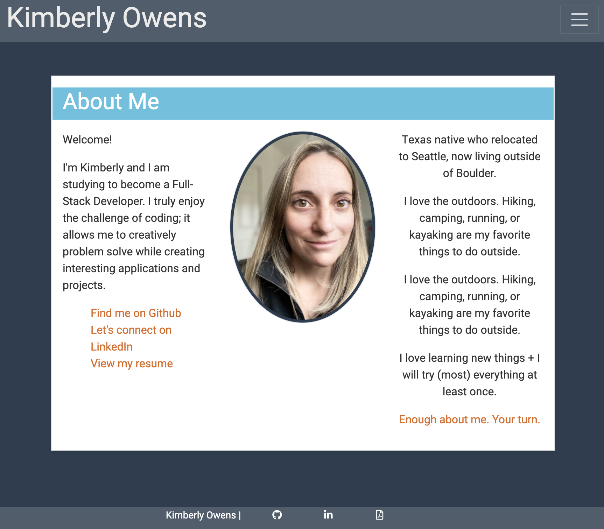

# Portfolio

### About

I created a responsive portfolio site using bootstrap elements and styling. The website consists of three pages: About me, Portfolio, and Contact. The portfolio page consists of one link to a rock, paper, scissors game and two placeholders for future projects. 

### Links

[Live site](https://kimberlyj227.github.io/portfolio/)

[Github profile](https://github.com/kimberlyj227/portfolio)

### Screenshots/images

Desktop:

